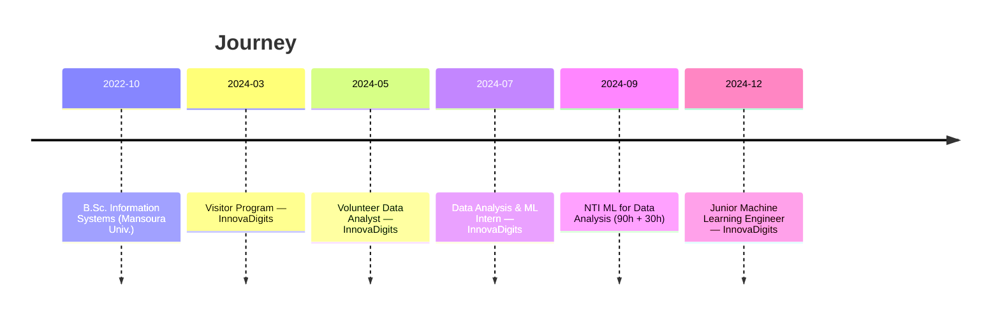

<!-- ======================= DARK THEME README ======================= -->

  

  
  
  

---

## 👋 About Me
I’m a **Machine Learning Engineer** passionate about designing and deploying **production-grade ML systems**.  
I focus on turning data into practical models, automating processes, and making AI accessible and useful for real products.

- 🧠 Specialized in ML, DL, and MLOps  
- ⚙️ End-to-End pipeline development  
- 🚀 Real impact: From data preprocessing → model training → ONNX deployment

---

## 💼 Experience

### 🧠 Junior Machine Learning Engineer — InnovaDigits  
*Dec 2024 – Present · El Mansoura, Egypt*  
- Built **hybrid ML pipelines** (tabular + image embeddings) → improved accuracy from `54%` to `81%`.  
- Developed **Auto/Semi-Auto Preprocessing & AutoML** modules.  
- Integrated models into products using **ONNX + Flask APIs**.  
- Collaborated closely with Product & Backend teams for production delivery.

### 📊 Data Analysis & ML Intern — InnovaDigits  
*Jul 2024 – Nov 2024*  
- Learned & applied Python, NumPy, Pandas, Matplotlib, Seaborn.  
- Developed ML models (Regression, Classification, Clustering).  
- Performed EDA & feature engineering.

### 📈 Volunteer Data Analyst — InnovaDigits  
*May 2024 – Jun 2024*  
- Created Excel dashboards with Power Query & DAX.  
- Improved internal reporting efficiency.

### 🧭 Visitor Program — InnovaDigits  
*Mar 2024 – Apr 2024*  
- Rotational exposure to multiple teams (Tech, Product, HR).  
- Gained foundational understanding of the company’s ML workflow.

---

### 🎓 Education & Career Timeline

---

## 🧰 Technical Skills

### 🐍 Programming & Core

### 🤖 Machine Learning & AI

### 🧠 Deep Learning & GenAI

### 🚀 Deployment & MLOps

---

## 🏅 Certifications
- 📜 Machine Learning for Data Analysis — NTI *(2024 · 90h + 30h)*  
- 📜 Transact SQL Queries using SQL Server *(2025)*

---

## 🎓 Education
**Bachelor's Degree in Information Systems (IS)**

- 
- 

---

## 🏆 Highlights

  
  
  
  

---

## 📬 Contact
- 📧 **ahmed.sheta.dev@gmail.com**  
- 🔗 [LinkedIn](https://www.linkedin.com/in/ahmed-sheta-dev)  
- 💻 [GitHub](https://github.com/Ahmed-sheta-dev)

  
  

  

