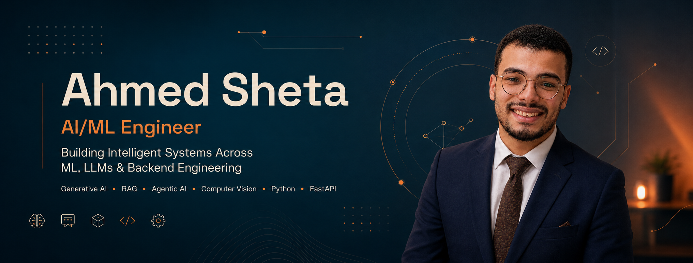
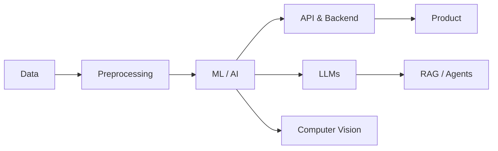

<!--
===============================================================================
Ahmed Sheta — GitHub Profile README
Version: 2.0.0
Updated: 2026-08-19
Positioning: AI/ML Engineer
Brand: Machine Learning × Applied AI × Backend Engineering
Palette:
  Dark Teal   #113741
  Dark Teal 2 #155263
  Burnt Peach #E26742
  Papaya Whip #F9EDD7
Typography direction:
  Headlines: Space Grotesk
  Body: Inter
===============================================================================
-->

<div align="center">



<br/>


<br/>

<a href="https://www.linkedin.com/in/ahmed-sheta-dev">
  
</a>
<a href="mailto:ahmed.sheta.dev@gmail.com">
  
</a>

</div>

---

## 👋 About Me

I'm **Ahmed Sheta**, an **AI/ML Engineer at innovaDigits** working at the intersection of:

**Machine Learning • Applied AI • Backend Engineering • Computer Vision**

My journey started with data analysis, then moved into machine learning, model experimentation, preprocessing, and AutoML workflows. Today, my work has expanded into **LLM-powered features, Python backend systems, reusable data/ML infrastructure, and intelligent product workflows**.

I enjoy working across the full engineering lifecycle:

> **Problem → Data → Intelligence → API → Product**

My current focus includes:

- 🤖 Machine Learning & ML Systems
- 🧠 Generative AI & LLM Applications
- 🔎 RAG & Context Engineering
- ⚡ Agentic AI & Workflow Orchestration
- 👁️ Computer Vision & Multimodal ML
- 🧩 Python Backend Engineering
- 🔌 APIs, background execution, and AI integration

---

## 🧠 What I Build


```mermaid
flowchart LR
    A["Data"] --> B["Preprocessing"]
    B --> C["ML / AI"]
    C --> D["API & Backend"]
    D --> E["Product"]

    C --> F["LLMs"]
    C --> G["Computer Vision"]
    F --> H["RAG / Agents"]
```

I’m especially interested in building systems where the challenge is not only:

> “Which model should we use?”

but also:

> “How do we make the intelligence reliable, reusable, observable, and easy to integrate into a real product?”

---

# 💼 Experience

## AI Engineer — innovaDigits
**Nov 2025 – Present**

- Building **LLM-powered product capabilities** with structured outputs, context-aware workflows, validation, and AI runtime instrumentation.
- Continuing to evolve **ML preprocessing and AutoML workflows** originally developed during my ML Engineer phase.
- Working on broader **Python backend and AI-system engineering**, including modular FastAPI services, reusable data-access components, and asynchronous ML execution.
- Contributing to platform modernization, system organization, and technical decision-making across AI/ML workflows.

---

## Machine Learning Engineer — innovaDigits
**Nov 2024 – Oct 2025**

- Developed and improved automated **data-preprocessing workflows** for tabular ML.
- Adapted and extended **AutoML workflows** for classification and regression.
- Implemented a confidential **multimodal image-classification workflow** combining pretrained visual representations with structured features.
- Worked with ML APIs, evaluation pipelines, model artifacts, and ONNX-based inference workflows.

---

## Data Analysis & ML Intern — innovaDigits
**Jun 2024 – Oct 2024**

- Built practical foundations in **Python, Pandas, NumPy, EDA, and feature engineering**.
- Worked with regression, classification, preprocessing, and model-evaluation workflows.
- Completed a historical weather analytics and ML capstone using multi-year daily data.

---

## Volunteer Data Analyst — innovaDigits
**Apr 2024 – May 2024**

- Built reporting and transformation workflows using **Excel, Power Query, Power BI, DAX, and Pivot Tables**.
- Developed a practical foundation in structured data workflows before transitioning into machine learning.

---

# 🚀 Featured Projects

## 🧠 ZakaaDash Platform

**AI/ML & Data Platform**

A modular Python platform for **tabular-data ingestion, preprocessing, AutoML, datasource management, and AI-assisted analytics**.

### Selected Contributions

- Migrated major backend workflows from **Flask to FastAPI**.
- Built reusable datasource and multi-format data-access components.
- Developed stateful preprocessing and ML workflow infrastructure.
- Integrated asynchronous model training using **Celery + Redis**.
- Built metadata-grounded **LLM dashboard recommendations** with structured validation and usage/cost tracing.

**Core Areas**

`FastAPI` `Python` `Machine Learning` `AutoML` `LLMs` `Polars` `Parquet` `Celery` `Redis`

---

## 👁️ Taxi Cabin Driver Verification System

<a href="https://github.com/oodiepix-tech/FaceRecognitionAI">
  
</a>

Built an end-to-end **computer vision and face-verification microservice** for driver enrollment and cabin identity decisions.

### Highlights

- Multi-sample driver enrollment and embedding profiles
- SCRFD face detection
- InsightFace 512-D embeddings
- Adaptive low-light preprocessing
- Robust similarity fusion and uncertainty handling
- FastAPI-based service architecture

### Measured Detector Optimization

Migrated from **MTCNN → SCRFD** after same-corpus local CPU replay:

```text
274.6 ms/image → 14.7 ms/image
```

*Detector timing only; not an end-to-end latency or accuracy metric.*

**Core Stack**

`Python` `FastAPI` `OpenCV` `InsightFace` `SCRFD` `ONNX Runtime`

---

## 🧬 Confidential Multimodal Image-Classification Project

Implemented an end-to-end **multimodal ML experimentation workflow** under technical-lead guidance.

### Technical Work

- Pretrained **ViT, MobileNetV2, and ResNet50** image representations
- Handcrafted **GLCM + LBP** texture features
- Structured feature integration
- DNN and SVM experimentation
- Hyperparameter search
- Persisted feature tables and experimental model artifacts

**Core Stack**

`Python` `TensorFlow` `PyTorch` `Hugging Face` `scikit-learn` `OpenCV`

> Project context and performance metrics are intentionally omitted due to confidentiality and evaluation constraints.

---

## 🏠 Airbnb-Style Rental Marketplace — Django

<a href="https://github.com/ahmed-sheta-dev/airbnb">
  
</a>

A server-rendered **Django rental marketplace prototype** demonstrating Python backend and relational application design.

### Highlights

- Modular Django application structure
- Relational property, booking, review, and profile models
- Django ORM search, filtering, annotations, and aggregates
- Authentication/profile integration
- Owner-scoped listing management
- Reservation validation and overlap checks
- Server-calculated booking totals
- Multi-image formsets

**Core Stack**

`Python` `Django` `Django ORM` `SQLite` `Bootstrap`

---

## 🌦️ Comprehensive Weather Analytics & ML — Mansoura

<a href="https://github.com/ahmed-sheta-dev/Comprehensive-Weather-Analytics-ML-Mansoura-1994-2024-">
  
</a>

Notebook-based historical weather analytics and ML workflow using daily records spanning **1994–2024**.

### Work Included

- Multi-file ingestion and cleaning
- Exploratory data analysis
- Temporal and calendar features
- Rolling statistics
- Prior-year comparisons
- Regression and classification experiments
- Chronological train/test evaluation

**Core Stack**

`Python` `Pandas` `NumPy` `scikit-learn` `Matplotlib` `Seaborn` `Jupyter`

---

# 🧰 Tech Stack

## Programming & Data

<p>


</p>

---

## Machine Learning

<p>


</p>

`Feature Engineering` • `Data Preprocessing` • `Model Evaluation` • `Cross-Validation` • `Hyperparameter Tuning` • `Classification` • `Regression`

---

## Generative AI & LLM Systems

<p>


</p>

`Prompt Engineering` • `Context Engineering` • `Structured Outputs` • `LLM Integration` • `Workflow Orchestration`

---

## Computer Vision

<p>


</p>

`Face Detection` • `Face Verification` • `Embeddings` • `Multimodal ML` • `Vision Transformers`

---

## Backend & AI Systems

<p>


</p>

`REST APIs` • `Pydantic` • `Background Jobs` • `Modular Python Services`

---

# 🎓 Education

### Faculty of Computer & Information Sciences — Mansoura University

**B.Sc. in Information Systems (IS)**  
**2021 – 2025 · Overall Grade: Very Good**

---

# 🏅 Certifications & Training

- **Fullstack Python & Django — Udemy** · 40 hours · 2026
- **Transact SQL queries using SQL server — Mahara-Tech** · 2025
- **Machine Learning for Data Analysis — NTI** · 90 technical hours · 2024

---

## 📊 GitHub Activity

<div align="center">

  <a href="https://github.com/Ahmed-sheta-dev">
    
  </a>

  <a href="https://github.com/Ahmed-sheta-dev">
    
  </a>

</div>

---

## 🐍 Contribution Activity

<div align="center">

<picture>
  <source
    media="(prefers-color-scheme: dark)"
    srcset="https://raw.githubusercontent.com/Ahmed-sheta-dev/Ahmed-sheta-dev/output/github-snake-dark.svg"
  />
  <source
    media="(prefers-color-scheme: light)"
    srcset="https://raw.githubusercontent.com/Ahmed-sheta-dev/Ahmed-sheta-dev/output/github-snake.svg"
  />
  
</picture>

</div>

---

# 🤝 Let's Connect

<div align="center">

Building at the intersection of:

### Machine Learning × Applied AI × Backend Engineering

<br/>

<a href="https://www.linkedin.com/in/ahmed-sheta-dev">
  
</a>

<a href="mailto:ahmed.sheta.dev@gmail.com">
  
</a>

<br/><br/>

**Building the intelligence — and the software around it.**

</div>

